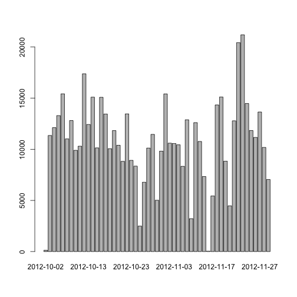

# Reproducible Research: Peer Assessment 1

## Loading and preprocessing the data
Loading the data

```r
unzip("activity.zip")
data <- read.csv("activity.csv")
```

Processing the data into a format suitable for analysis

```r
data <- transform(data, date = as.Date(date,format="%Y-%m-%d"))
```
## What is mean total number of steps taken per day?
For this part of the assignment, we ignore the missing values in the dataset.

```r
ind <- !is.na(data$steps)
fdata <- data[ind,]
```
Making a histogram of the total number of steps taken each day

```r
perday <- tapply(fdata$steps,fdata$date,FUN=sum)
barplot(perday)
```

 

Calculation of the mean and median total number of steps taken per day

```r
mean(perday)
```

```
## [1] 10766
```

```r
median(perday)
```

```
## [1] 10765
```
## What is the average daily activity pattern?
Making a time series plot of the 5-minute interval (x-axis) and the average number of steps taken, averaged across all days (y-axis)

```r
library(plyr)
perinterval <- ddply(fdata, "interval", summarise, mean = mean(steps))
plot (perinterval, type="l")
```

 

Which 5-minute interval, on average across all the days in the dataset, contains the maximum number of steps?

```r
perinterval[which(perinterval$mean==max(perinterval$mean)),"interval"]
```

```
## [1] 835
```
## Imputing missing values
There are a number of days/intervals where there are missing values. The presence of missing days may introduce bias into some calculations or summaries of the data.

Calculation of the total number of missing values in the dataset

```r
sum(is.na(data$steps))
```

```
## [1] 2304
```

Choosing a strategy for filling in all of the missing values in the dataset: we use the mean for 5-minute interval.

Creating a new dataset that is equal to the original dataset but with the missing data filled in.

```r
cdata <- merge(data,perinterval,by="interval")
cdata[is.na(cdata$steps),"steps"] <- cdata[is.na(cdata$steps),"mean"]
```

Making a histogram of the total number of steps taken each day and calculating the mean and median total number of steps taken per day. Median value increased a little bit and now it is equal to mean value.

```r
cperday <- tapply(cdata$steps,cdata$date,FUN=sum)
barplot(cperday)
```

 

```r
mean(cperday)
```

```
## [1] 10766
```

```r
median(cperday)
```

```
## [1] 10766
```
## Are there differences in activity patterns between weekdays and weekends?
We use the dataset with the filled-in missing values for this part.

Creating a new factor variable in the dataset with two levels – “weekday” and “weekend” indicating whether a given date is a weekday or weekend day.

```r
cdata <- transform(cdata, date = as.Date(date,format="%Y-%m-%d"))
cdata$weekdays <- weekdays(cdata$date)
cdata$daytype <- as.factor(cdata$weekdays)
levels(cdata$daytype) <- list(
    weekday = c("Monday", "Tuesday","Wednesday","Thursday","Friday"),
    weekend = c("Saturday", "Sunday")
)
```

Making a panel plot containing a time series plot of the 5-minute interval (x-axis) and the average number of steps taken, averaged across all weekday days or weekend days (y-axis).

```r
library(ggplot2)
pplot <- ddply(cdata, .(interval,daytype), summarise, steps = mean(steps))
qplot(interval, steps, data=pplot, facets = daytype ~ ., geom = "line")
```

 
